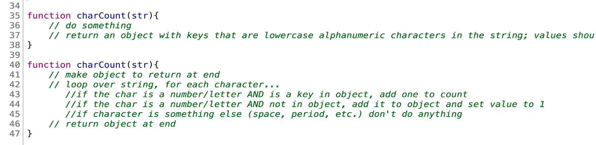
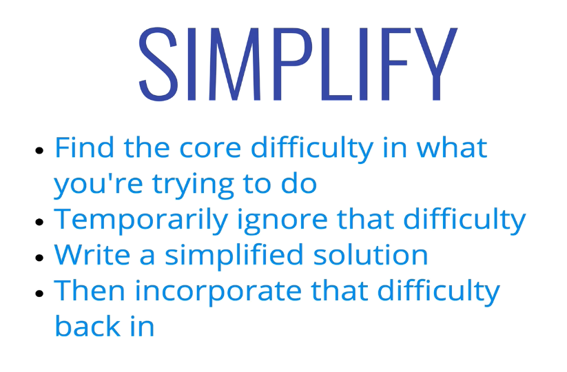

<h1>Section4: Problem Solving Approach</h1>

<h2>How do you improve ?</h2>

1. Devise a plan for solving problems
2. Master common problem solving patterns

 

 

Example

  

Example

  

Example

  

Example

before)

after)

