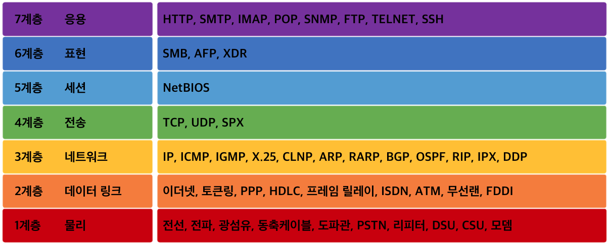
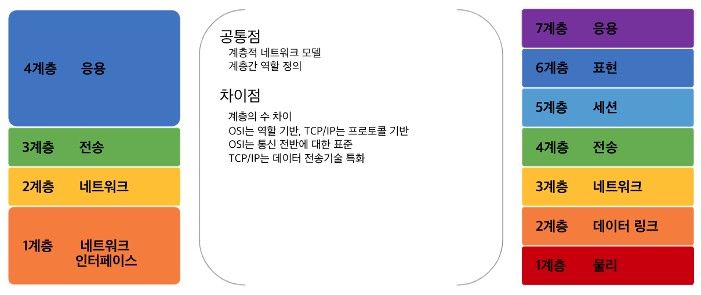
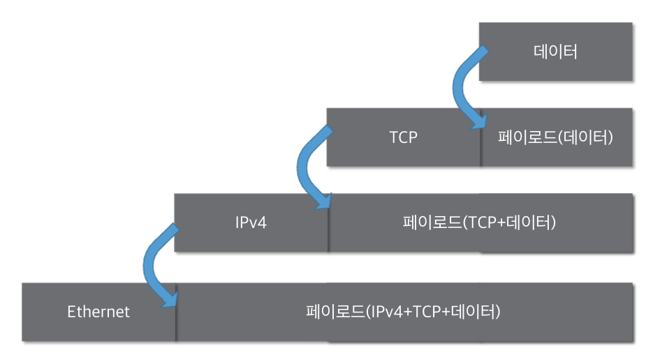
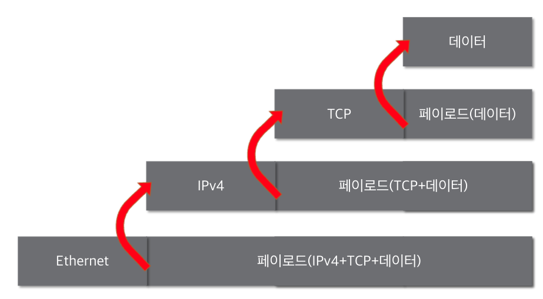
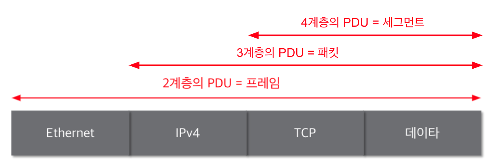
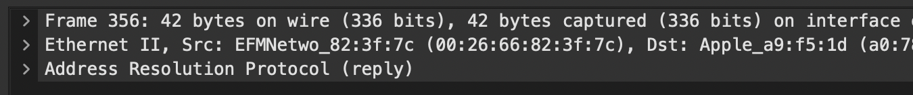
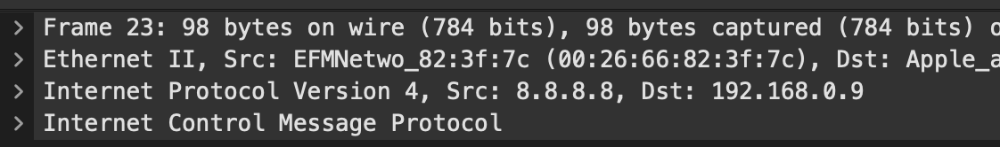

# 2. 네트워크의 기준! 네트워크 모델

## 네트워크 모델의 종류

1. TCP/IP 모델

   - 현재의 인터넷에서 컴퓨터들이 서로 정보를 주고 받는데 쓰이는 통신 규약(**프로토콜**)의 모음
   - 4계층 응용 - 3계층 전송 - 2계층 네트워크 - 1계층 네트워크 인터페이스

1. OSI 7계층 모델

   - 데이터를 주고 받을때 데이터 자체의 흐름을 각 구간별로 나눠 놓은 것

     

## 두 모델 비교

- TCP/IP: 네트워크를 통해 데이터를 전달할 때 기술 자체를 분류
- OSI 7 layer: 논리적으로 통신 전반에 걸쳐 역할을 나눠놓은 것  
  

 

## 패킷

### 패킷이란?

네트워크에서 전달하는 데이터의 형식화된 블록이다. 제어 정보와 사용자 데이터(페이로드) 로 이루어진다.

1. 패킷을 이용한 통신과정

   1. 캡슐화:
      요청을 보낼 때 여러 프로토콜을 이용하여 패킷을 만드는 과정. 상위 계층에서 하위 계층 방향으로  
       프로토콜을 붙인다. 예를 들어,. 데이터에 TCP 를 붙일때, 데이터는 payload 가 되고 TCP 는 header 가 된다.
      
   1. 디캡슐화: 요청을 받을 때 패킷을 하위 계층에서 상위 계층 방향으로 확인하는 과정  
      

2. 계층별 패킷 이름 - PDU(Protocol Data Unit)  
   

## 실습

Shark  
: 상위 계층에서 하위 계층으로 캡슐화된다.  
  

