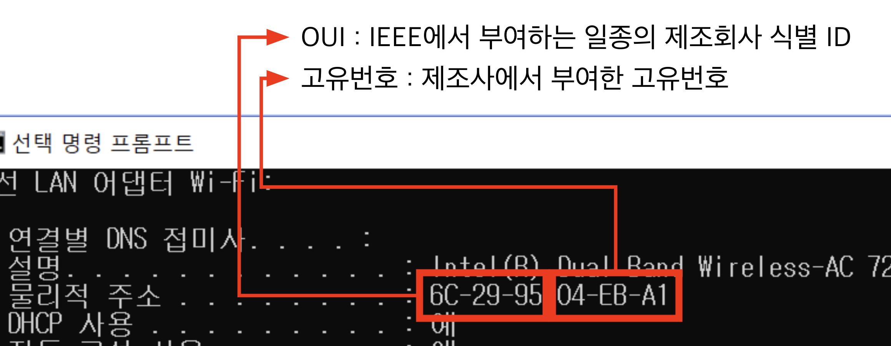
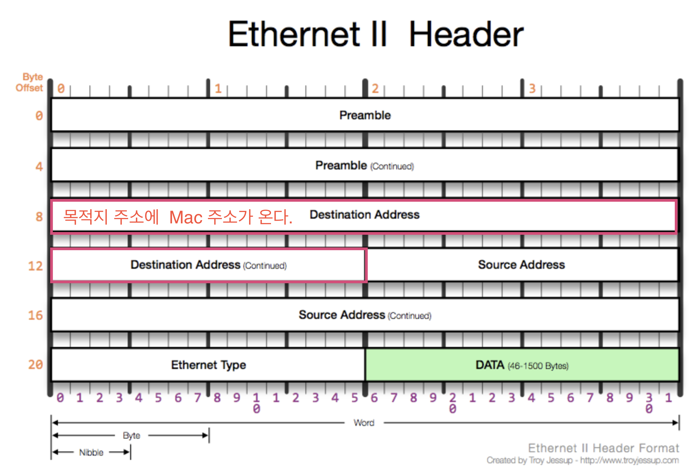
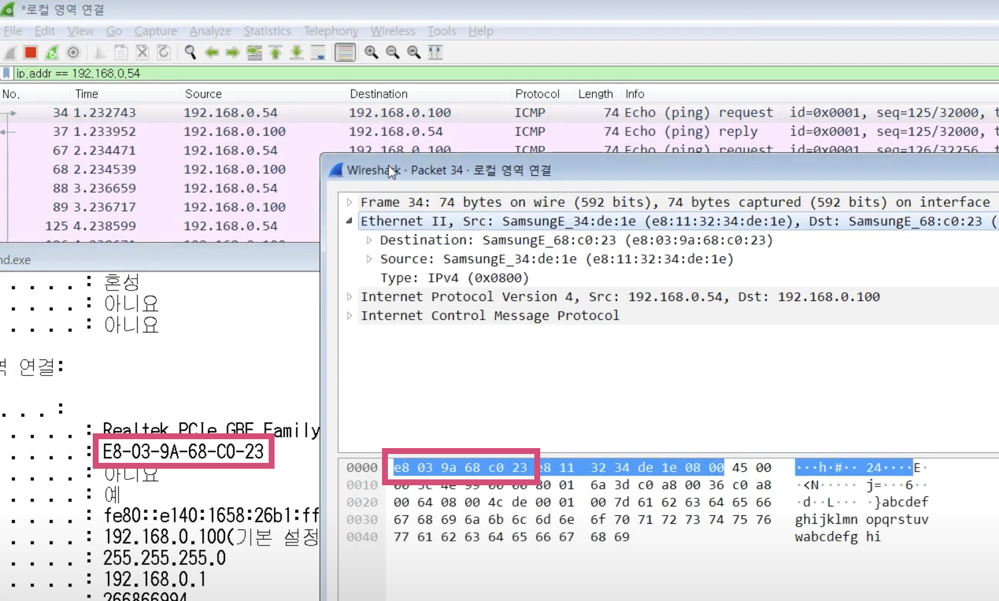
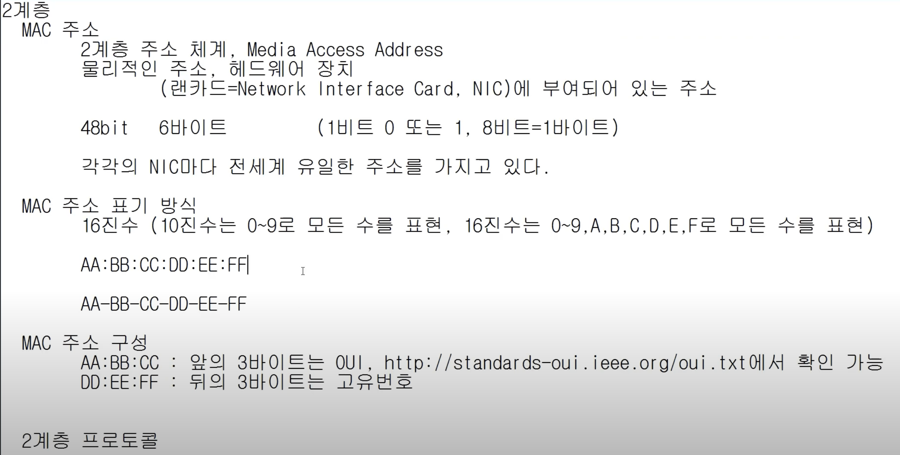

# 3. 가까이 있는 컴퓨터끼리는 이렇게 데이터를 주고 받는다.

## 2계층에서 하는일

1. 2계층의 기능
   하나의 네트워크 대역(같은 네트워크 상)에 있는 여러 장비들이 있을 때,  
   어떤 장비가 어떤 장비에게 데이터를 전달하는지, 그리고 전달하는 데이터가  
   오류가 있는지 없는지 확인하고 제어하는 역할. 오류제어, 흐름제어.
2. 2계층의 네트워크 크기
   다른 네트워크와 통신할 때는 항상 3계층이 도와주어야 한다.
    
3. 2계층에서 사용하는 주소
   물리적인 주소 = LAN 에서 통신할 때 사용하는 MAC 주소. 12개의 16진수로 이루어져 있다. (6 Bytes)
   전 세계 장비들이 고유한 값을 가지고 있다.
   
4. 2계층의 프로토콜
   LAN 에서 통신할 때 사용하는 Ethernet 프로토콜
   - Destination Address 6 bytes. 받는 사람 MAC 주소.
   - Source Address 6 bytes. 보내는 사람 MAC 주소.
   - Ethernet Type 2 bytes. 프로토콜 타입으로 DATA(payload) 안에 3계층 프로토콜이 들어가 있는데,  
     이를 미리 알려주는 역할을 한다.
     

## 실습

MacBook 은 ifconfig 로 확인 가능

