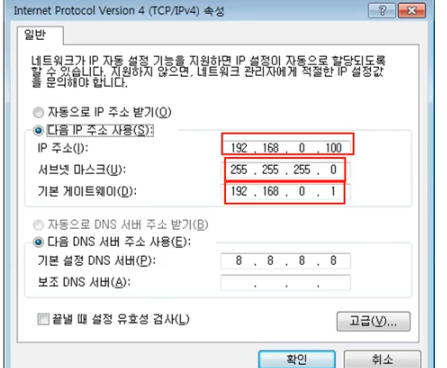
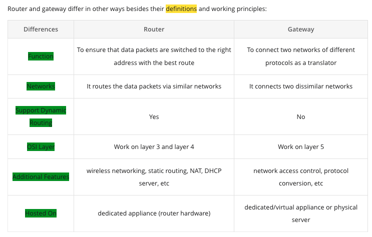

# 4. 실제로 컴퓨터끼리는 IP주소를 사용해 데이터를 주고 받는다.

## 3계층의 기능

### 3계층에서 하는 일

서로 다른 LAN 을 연결-> WAN

다른 네트워크 대역 즉, 멀리 떨어진 곳에 존재하는 네트워크까지 어떻게 데이터를 전달할 지 제어하는 일을 담당. 발신에서 착신 까지의 패킷의 경로를 제어

### 3계층에서 쓰는 주소

WAN 에서 통신할 때 사용하는 IP주소

### 3계층 프로토콜

IPv4 프로토콜

## 일반적인 IP주소

### Classful IP 주소

초창기에 쓰인 방식으로 낭비가 많다. IP 주소를 사용하는 사람이 적었기 때문에 각 클래스에 IP 가 남는 현상.

숫자 한 칸당 1바이트 만을 사용할 수 있기 때문에 총 256 개의 경우의 수가 있다.
`0.0.0.0 ~ 255.255.255.255`

A클래스 - 첫번째 필드는 네트워크 구분에 사용. 하나의 네트워크 대역에 (2의 8제곱) 의 3제곱 갯수의 PC 가 있다.
B클래스 - 두번째 필드까지 네트워크 구분에 사용. (2의 8제곱) 의 2제곱 갯수의 PC 가 있다.
...

### Classfulless IP 주소

서브넷 마스크를 사용하여 IP 낭비되지 않도록 잘라쓰는 방식으로 개선

- 서브넷 마스크
  클래스풀한 네트워크 대역을 나눠주는데 사용하는 값  
  어디까지가 네트워크 대역을 구분하는데 사용하고 어디서부터  
  호스트를 구분하는데 사용하는지 지정

### 사설 IP와 공인 IP

공인 IP? 인터넷 네트워크 통신망과 통신할 때 사용하는 IP 주소
사설 IP? 같은 네트워크 대역에서 사용하는 IP 주소

구글에서 검색을 할 경우, 사설 IP 가 공인 IP 로 바뀌어 사용된다.(NAT 기술을 이용하여 **IP 부족현상을 해결하기 위해** IP 를 바꾸는 것)
공인 IP 1개당 2의 32제곱 개의 사설 IP

Google 공인 IP

사설 IP.

실제 인터넷 세상에서는 공인 IP 로만 통신하므로 외부 네트워크 대역에서는 사설 IP 대역이 보이지 않는다.

## 특수한 IP 주소

Wildcard `0.0.0.0`
0.0.0.0 하단의 IP들을 제외한 나머지 모든 IP 를 의미

나 자신을 나타내는 주소 `127.0.0.1`

어딘가로 가려면 일단 여기로 게이트웨이 주소
네트워크 대역에서 가장 작거나 가장 큰 수를 쓴다.
공유기를 통해 밖으로 나간다. gateway. 외부와 통신할 때 무조건 통과해야 할 문의 값을 게이트웨이 주소이다.

