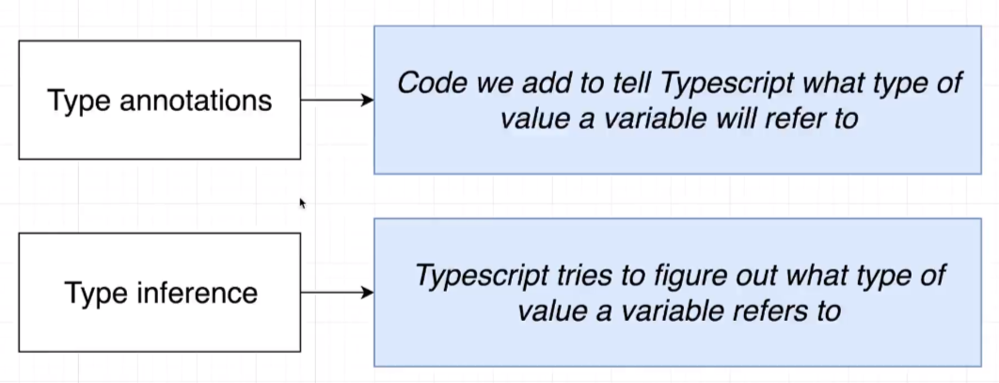
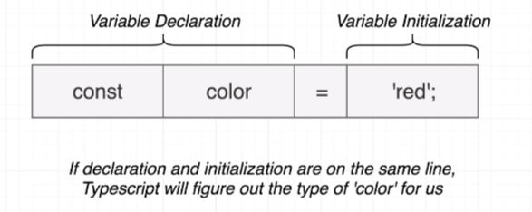
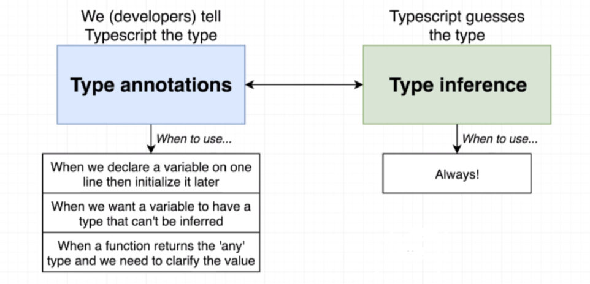

[Let's go to the course](https://www.udemy.com/course/typescript-the-complete-developers-guide/)

## Progress

#### 2022/05/04

<b>Section1: Getting Started with Typescript</b>

  

<b>Section2: What is a Type System?</b>

- Important Point of This Lecture is **Design Patterns** With TS!

  

  

- **Why we need to use Typescript?**

  

#### 2022/05/05

<b>Section3: Type Annotations in Action</b>, 16 - 20

Type Inference?

When to use?

