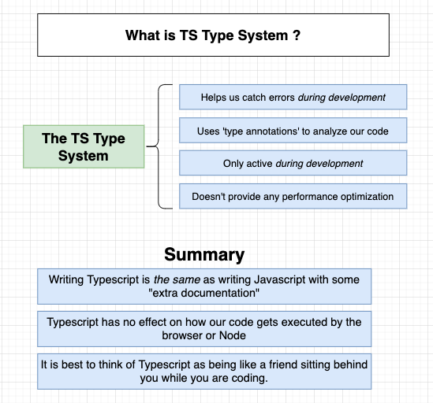
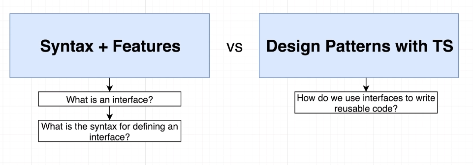
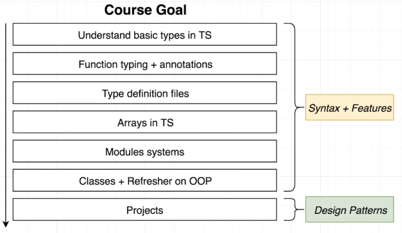
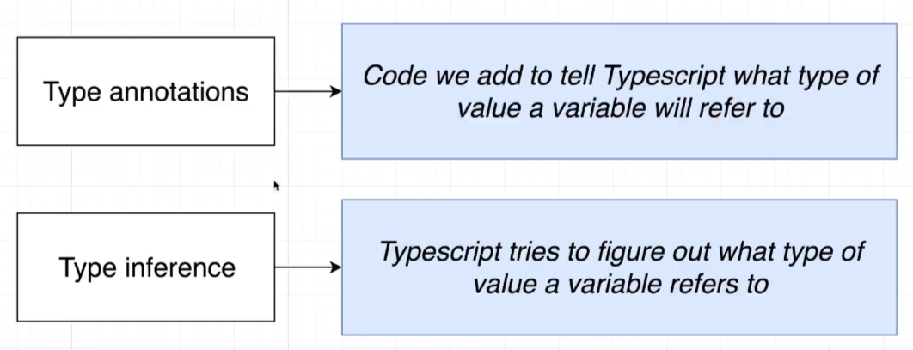
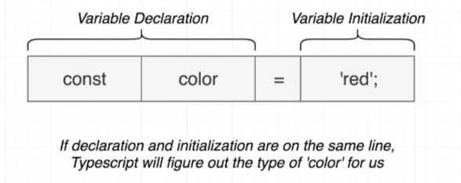
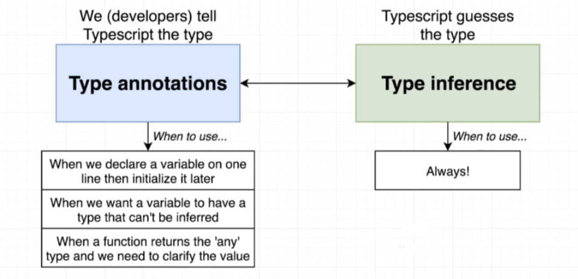
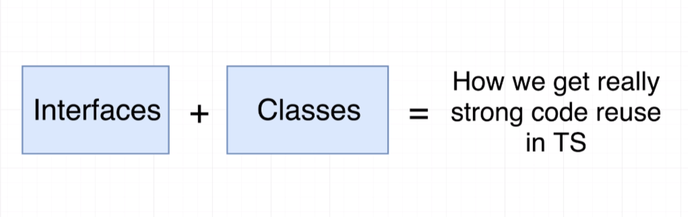
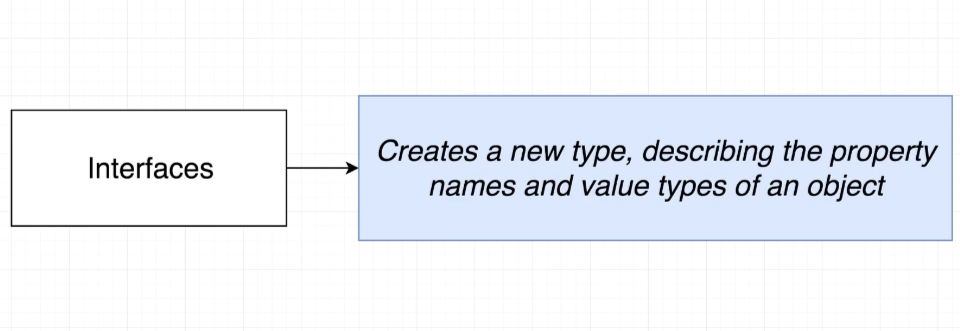
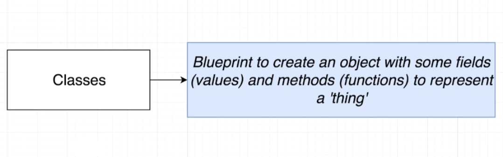
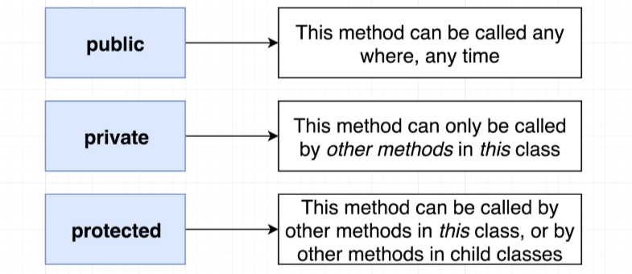

## Progress

#### 2022/05/04

<b>Section1: Getting Started with Typescript</b>

  

<b>Section2: What is a Type System?</b>

- Important Point of This Lecture is **Design Patterns** With TS!

  

  

- **Why we need to use Typescript?**

  

#### 2022/05/05

<b>Section3: Type Annotations in Action</b>, 16 - 20

Type Inference?

When to use?

#### 2022/05/07

<b>Section3: Type Annotations in Action</b>, 21 - 24
<b>Section4: Annotations With Functions and Objects</b>
<b>Section5: Mastering Typed Arrays</b>
<b>Section6: Tuples in Typescript</b>

#### 2022/05/08

<b>Section7: The All-Important Interface</b>

<b>Section8: Building Functionality with Classes</b>

